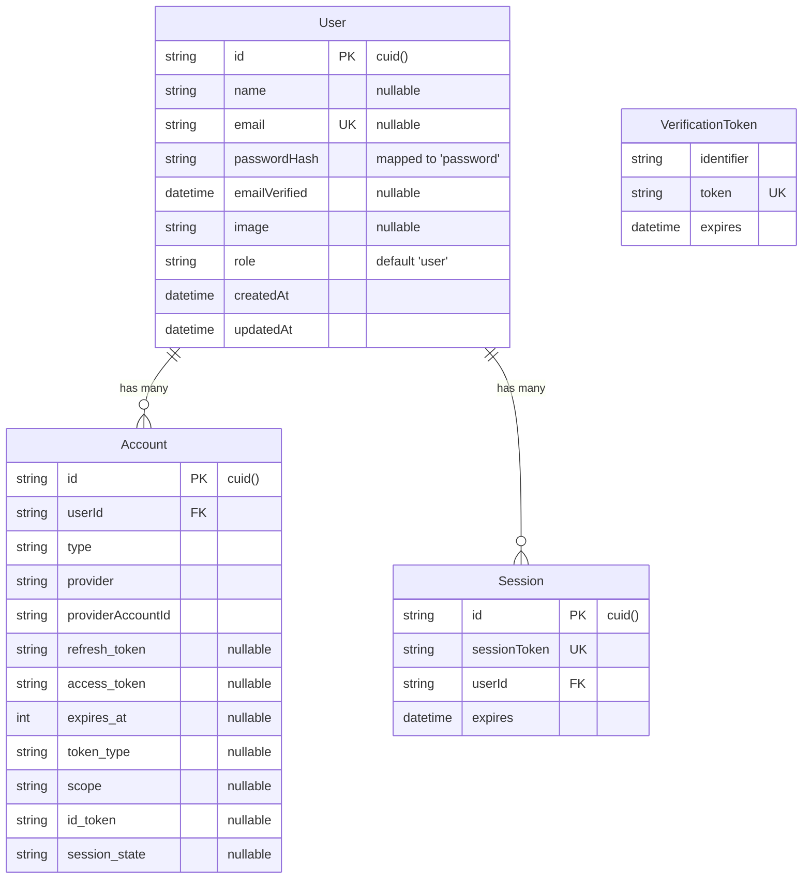
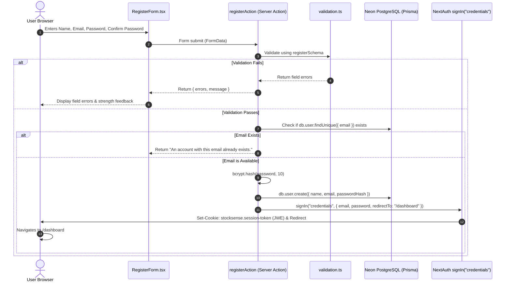
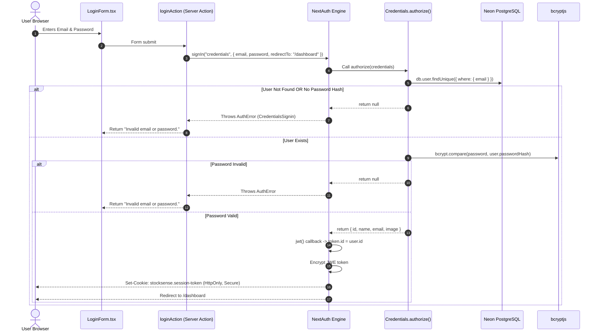
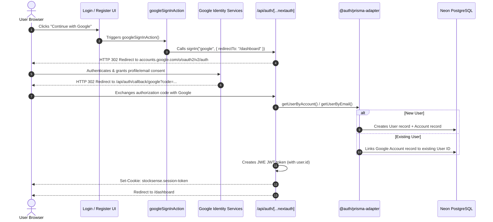
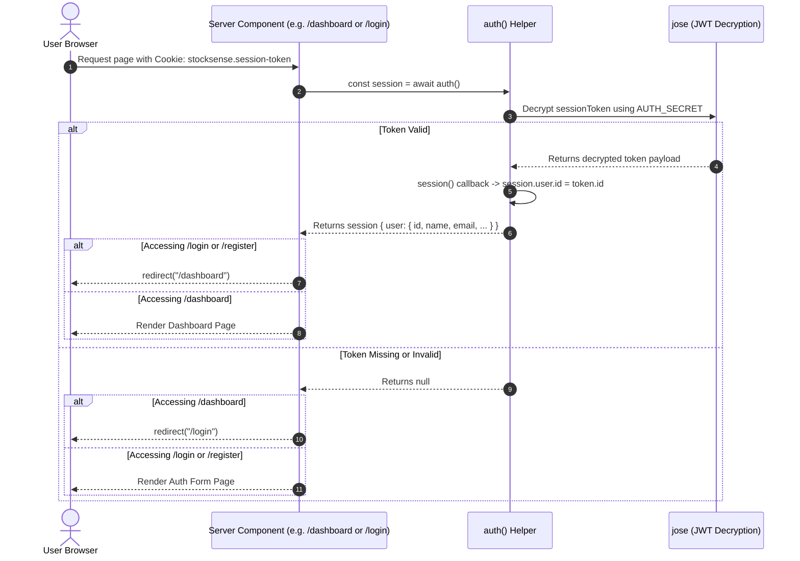
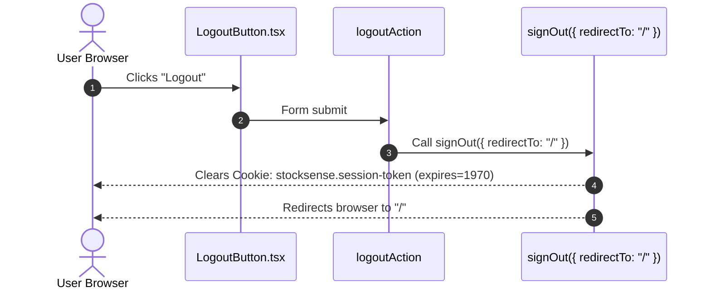

# StockSense Authentication Architecture & Flow Documentation

This document provides a comprehensive guide to the authentication architecture, data models, and request flows implemented in **StockSense**, mirroring the design established in **Dino_Mate**.

---

## 1. Architecture & Tech Stack

| Component | Technology | Purpose |
|---|---|---|
| **Framework** | Next.js 16 (App Router) + React 19 | Server Actions, React 19 `useActionState`, and Route Handlers |
| **Authentication Engine** | Auth.js / `next-auth` (v5.0.0-beta.31) | Session lifecycle, JWT tokens, OAuth, and Credentials providers |
| **ORM** | Prisma 7 (`@prisma/client`, `@prisma/adapter-pg`, `pg`) | Connection-pooled PostgreSQL database management |
| **Database** | Neon Serverless PostgreSQL | Relational storage for users, accounts, and session metadata |
| **Password Hashing** | `bcryptjs` (Cost factor: 10) | Secure one-way hashing with salt generation (OWASP standard) |
| **Validation** | `zod` | Runtime schema validation and sanitization for credentials |
| **Styling** | Tailwind CSS v4 + Lucide Icons | Responsive glassmorphic UI and visual strength feedback |

---

## 2. Environment Configuration

All authentication behavior is driven by the following environment variables defined in [`.env`](file:///a:/Ashutosh%20Maurya/YT%20web%20D/Hackathon/StockSense/.env):

```env
# PostgreSQL Database (Neon)
DATABASE_URL="postgresql://<user>:<password>@<endpoint>/neondb?sslmode=require&channel_binding=require"
DIRECT_URL="postgresql://<user>:<password>@<endpoint>/neondb?sslmode=require&channel_binding=require"

# NextAuth / Auth.js
AUTH_SECRET="your-32-char-random-secret"
NEXTAUTH_SECRET="your-32-char-random-secret"
NEXTAUTH_URL="http://localhost:3000"
AUTH_TRUST_HOST=true

# Google OAuth 2.0 Credentials
GOOGLE_CLIENT_ID="<client-id>.apps.googleusercontent.com"
GOOGLE_CLIENT_SECRET="<client-secret>"
```

---

## 3. Database Models & Schema

The database layer is defined in [`prisma/schema.prisma`](file:///a:/Ashutosh%20Maurya/YT%20web%20D/Hackathon/StockSense/prisma/schema.prisma):



### Key Schema Characteristics:
- **`User.passwordHash`**: Maps internally to the SQL column `password`. Remains null for users authenticated exclusively via Google OAuth.
- **`Account`**: Linked via `onDelete: Cascade` to ensure complete cleanup when a user profile is removed.
- **Account Linking**: With `allowDangerousEmailAccountLinking: true`, users who first sign up with email/password can later log in with Google using the same email address without creating duplicate accounts.

---

## 4. End-to-End Authentication Flows

### 4.1 Flow A: Email & Password Registration (Sign Up)



---

### 4.2 Flow B: Email & Password Login



---

### 4.3 Flow C: Google OAuth 2.0 Login / Sign Up



---

### 4.4 Flow D: Session Verification & Route Guarding



---

### 4.5 Flow E: Sign Out (Logout)



---

## 5. Security & Session Best Practices

1. **JWE Session Encryption**:
   - The session token is an encrypted JSON Web Encryption (JWE) token rather than a plain readable JWT.
   - It is encrypted with AES-256-GCM using `AUTH_SECRET`.
2. **Dedicated Cookie Namespace**:
   - The session cookie is named `stocksense.session-token` instead of the generic default `authjs.session-token`.
   - This prevents key decryption conflicts when developing multiple NextAuth applications on `http://localhost:3000`.
3. **Password Security**:
   - Passwords must satisfy complexity constraints: minimum 8 characters, at least 1 uppercase letter, 1 lowercase letter, 1 number, and 1 special character.
   - Hashed using `bcryptjs` with salt round cost factor 12. Plaintext passwords are never persisted.
4. **Brute-Force & Account Enumeration Prevention**:
   - Credential sign-in errors return generic messages (`"Invalid email or password."`) to prevent user enumeration attacks.
5. **Cookie Security Options**:
   - `httpOnly: true` (prevents client-side JavaScript access / XSS theft).
   - `sameSite: "lax"` (mitigates Cross-Site Request Forgery).
   - `secure: true` automatically enabled in production environments.

---

## 6. Codebase File Structure Reference

```
StockSense/
├── auth.ts                                       # NextAuth v5 configuration & providers
├── prisma.config.ts                              # Prisma 7 CLI configuration
├── prisma/
│   └── schema.prisma                             # Auth models (User, Account, Session, Token)
└── src/
    ├── app/
    │   ├── api/auth/[...nextauth]/route.ts       # Catch-all NextAuth API route handler
    │   ├── (public)/
    │   │   ├── login/page.tsx                    # Login Page (Server Component guard)
    │   │   └── register/page.tsx                 # Register Page (Server Component guard)
    │   ├── (dashboard)/
    │   │   └── dashboard/page.tsx                # Protected Dashboard Page
    │   ├── layout.tsx                            # Root Layout with Providers
    │   └── page.tsx                              # Landing / Welcome Page
    ├── components/
    │   ├── common/
    │   │   └── providers.tsx                     # Client SessionProvider wrapper
    │   └── ui/
    │       └── button.tsx                        # Reusable button with variants
    ├── features/auth/
    │   ├── actions/
    │   │   └── auth.ts                           # Server Actions (register, login, google, logout)
    │   ├── components/
    │   │   ├── auth-card.tsx                     # Glassmorphic card container
    │   │   ├── google-button.tsx                 # Google OAuth button with pending state
    │   │   ├── LoginForm.tsx                     # Login form with client validation & toggle
    │   │   ├── RegisterForm.tsx                  # Registration form with strength meter
    │   │   ├── logout-button.tsx                 # Form logout trigger
    │   │   └── password-strength.tsx             # Interactive strength score meter
    │   └── schemas/
    │       └── validation.ts                     # Zod registration & login schemas
    └── lib/
        ├── auth/
        │   └── nextauth.ts                       # Helper re-exports (auth, handlers, signIn, signOut)
        ├── db/
        │   └── db.ts                             # Prisma client singleton & connection pool
        └── utils.ts                              # Tailwind cn() merge utility
```
